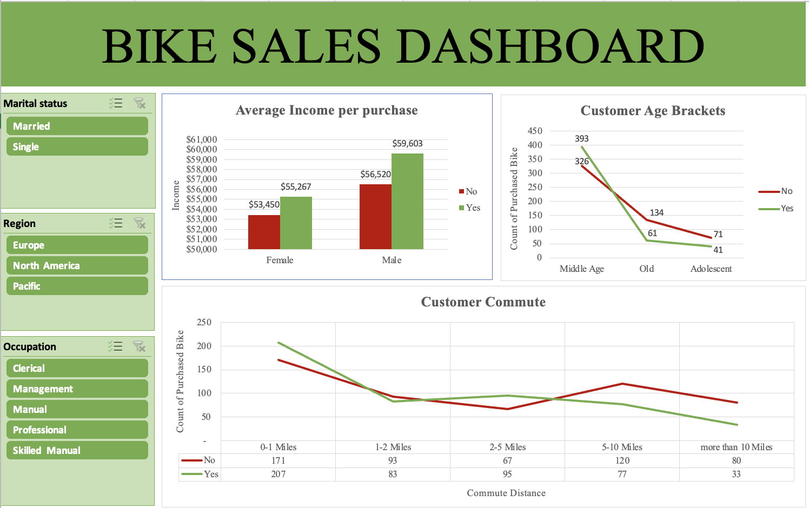

# Bike Buyer Analysis Dashboard (Excel)

An Excel dashboard analyzing 1,026 customer records to identify which demographic and lifestyle factors actually predict whether someone buys a bike, built with PivotTables and PivotCharts.

## The business question

A bike retailer wants to stop guessing who to target with ads and start targeting based on data. This dashboard breaks down purchase behavior by income, region, commute distance, car ownership, occupation, and education to find out which of those actually move the needle.

## What's in the data

- **1,026 customers** with purchase outcome (Yes/No)
- **14 fields per record**: marital status, gender, income, children, education, occupation, home ownership, cars owned, commute distance, region, age, age bracket, and whether they purchased a bike

## Key findings

- **Overall purchase rate: 48.2%** — close to a coin flip, so the interesting story is in the segments, not the average
- **Commute distance is the strongest driver, and it runs backwards from intuition**: customers commuting 0-5 miles buy at 55-59%, but that drops to 29% for those commuting more than 10 miles. Long commutes may mean less interest in cycling as a commute alternative, or just less time for it
- **Car ownership is the single clearest predictor**: 60% purchase rate for zero-car households falls to 34-38% once a customer owns 2+ cars — bikes are competing with cars as a transport choice, not just a lifestyle purchase
- **Marital status matters more than income**: single customers buy at 54.3% vs. 43.0% for married customers, despite no meaningful income difference between the two groups
- **Region gap**: Pacific customers buy at 58.9% vs. 43.3% in North America — worth investigating whether that's a marketing gap or a genuine market difference
- **Gender is close to irrelevant** (48.5% women vs. 48.0% men) — a useful negative finding, since gender-targeted campaigns would likely be a wasted a spend here

## How the dashboard works

- **PivotTables** cross-tabulate purchase rate against income (by gender), and against age bracket
- **PivotCharts** visualize each breakdown for a non-technical audience
- Underlying analysis (commute, cars, marital status, region, occupation, education) was pulled directly from the raw customer table to identify the segments worth building into the dashboard

## Tools used

Excel (PivotTables, PivotCharts, data segmentation analysis)

